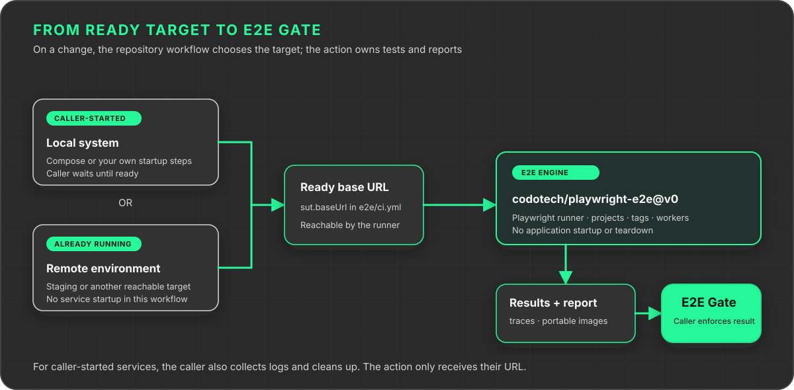
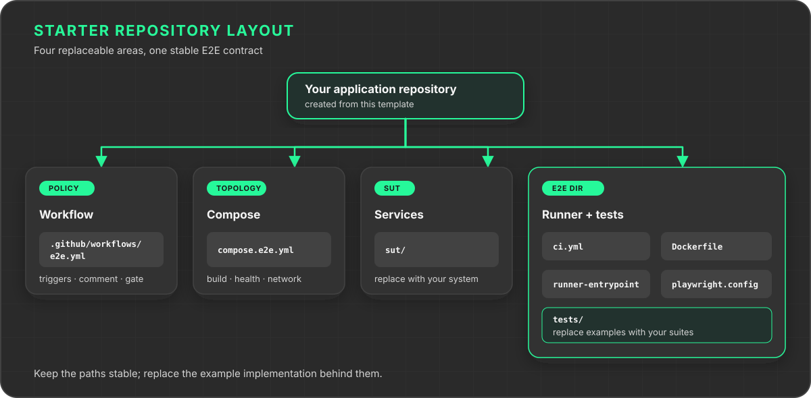

# Playwright E2E Starter

A ready-to-run repository template for testing a Docker Compose or externally managed system with [codotech/playwright-e2e](https://github.com/codotech/playwright-e2e).

The included echo service is intentionally small. It proves the complete path through Docker Compose, API and browser projects, Playwright tags, runner reuse, traces, reports, portable images, pull-request comments, and a required E2E gate.



## Create your repository

1. Select **Use this template** on GitHub.
2. Keep the `e2e/` directory name.
3. Replace `sut/` and `compose.e2e.yml` with the services your tests need, or follow the existing-environment recipe below.
4. Set the SUT URL and execution profiles in `e2e/ci.yml`.
5. Replace the example tests under `e2e/tests/`.
6. Define projects, reporters, workers, retries, and trace policy in `e2e/playwright.config.ts`.
7. Require the **E2E Gate** check before merging.

The workflow follows the latest compatible 0.x action through `@v0`. Use `@v0.2.0` when an exact release is required.

## What belongs where



The application repository owns the workflow policy and SUT topology. The external action owns the execution engine. Tests and their dependencies stay in `e2e/`, so any material runner change produces a new content hash and runner image. Service-only or profile-only changes reuse the validated runner while still rebuilding and testing the SUT.

## Configure CI selection

`e2e/ci.yml` provides named profiles:

```yaml
profiles:
  pull-request:
    projects: [api, chromium]
    labels: ["@smoke"]
    labelMatch: any

  main:
    projects: [api, chromium]
    labels: []
    labelMatch: all
```

A project is a Playwright execution variant configured in `playwright.config.ts`. A label is a Playwright tag attached to a test, such as `@smoke`. They are separate filters and the selected suite is their intersection.

Manual runs can choose a profile and override projects, tags, or tag matching without editing the repository. `all` requires every requested tag; `any` accepts any requested tag.

The root action runs in one GitHub job. Keep `execution.shards: 1`. Playwright workers still execute tests concurrently inside the runner container.

## Run locally

Prerequisites: Docker, Node.js 22, Corepack, and pnpm 10.26.2.

```bash
corepack enable
corepack prepare pnpm@10.26.2 --activate
pnpm --dir e2e install --frozen-lockfile
pnpm --dir e2e install:browsers
docker compose -f compose.e2e.yml up --detach --build --wait
BASE_URL=http://127.0.0.1:4173 pnpm --dir e2e test
docker compose -f compose.e2e.yml down --volumes --remove-orphans
```

Always run the final cleanup command, including after a failed test. Run the static check with:

```bash
pnpm --dir e2e test:static
```

### Target an existing environment

This recipe requires the action's optional-Compose change, which is not in `v0.2.0`. Update the action reference to a release or commit containing that change before using it.

Replace the `sut` section in `e2e/ci.yml` with:

```yaml
sut:
  baseUrl: https://staging.example.com
```

Omit `composeFile` entirely. The example `sut/` directory and root Compose file are not needed in this mode. Keep the runner Dockerfile, entrypoint, Playwright configuration, reporters, and workflow result handling.

After installing the E2E dependencies, run locally with:

```bash
BASE_URL=https://staging.example.com pnpm --dir e2e test
```

CI passes the same configured URL into the test container. It does not start, collect service logs from, or tear down the target. Docker is still used for the runner and report images. The target must already be reachable and ready. Tests can modify data, so select an authorized test environment.

Do not put credentials in the URL. Arbitrary workflow environment variables, including API tokens, are not currently forwarded into the test container.

## CI behavior

The supplied workflow runs for pull requests, pushes to `main`, and manual dispatches. It:

- cancels stale runs for the same pull request or ref;
- checks out the application before invoking the action;
- uses `pull-request`, `main`, or the manually selected profile;
- creates or updates one E2E report comment on pull requests;
- publishes the test results, Playwright HTML report, traces, runner image, and report image;
- preserves the failing result after the report comment is written.

The action needs no inherited secrets. Add repository or environment secrets to the workflow only when your SUT requires them.

## Artifacts

| Artifact | Purpose |
| --- | --- |
| `e2e-results` | Final result, CTRF data, HTML report, traces, screenshots, video, and service logs |
| `e2e-runner-image` | Portable archive of the exact Playwright runner used |
| `e2e-report-image` | Portable image serving the HTML report on port 8080 |

Artifacts are retained for the number of days configured in `e2e/ci.yml`. The image archives are not published to a registry.

## Replace the example SUT

The example service exposes `/health` and `/echo` on port 4173. When adapting the template:

- make every required service part of `compose.e2e.yml`;
- add Compose health checks so the test starts only after the system is ready;
- expose the browser-facing URL on the host and place it in `sut.baseUrl`;
- keep teardown safe for repeated and cancelled runs;
- avoid installing application dependencies directly on the GitHub host.

The action runs Compose with build and wait enabled, always captures logs, and removes containers, networks, and volumes after the suite.

## Upgrade the action

Review changes in the core repository, then update the major version in `.github/workflows/e2e.yml`. The current line uses `@v0`; move it to `@v1` only when adopting a future 1.x release.

## License

[MIT](LICENSE)
